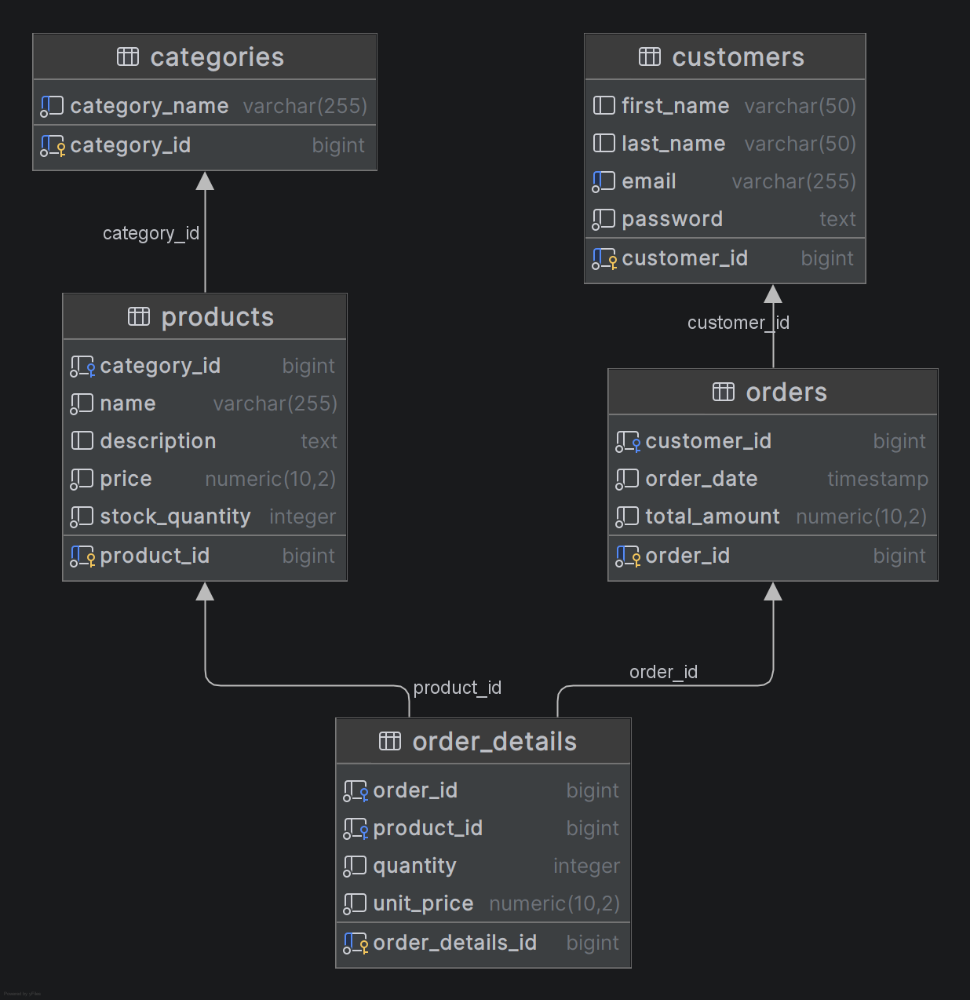

# E-Commerce Database Design

This ReadMe contains the analysis and design for an E-Commerce website database. It includes the DB schema creation script, entity relationships, ERD diagram, and reporting queries.

---

## DB Schema

The system includes the following key components:
 
- **Customer** orders **Order** (0 or many).
- **Order** ordered by **Customer**.

- **Product** ordered in **Order** (0 or many).
- **Order** order for **Product** (1 or many).

- **Category** contains **Product** (many).
- **Product** belongs to **Category** (many).

- **Order_Details** is a joining table between **Order** and **Product** (many-to-many).


### ERD Relationship Overview

| Parent Entity | Relation | Child Entity |
|---------------|----------|--------------|
| Customers     | 1 → *    | Orders       |
| Orders        | 1 → *    | Order Details|
| Products      | 1 → *    | Order Details|
| Categories    | 1 → *    | Products     |


---

## ERD Diagram



---

## Reporting Queries

### 1. Daily Revenue Report
```sql
-- Replace '2025-11-16' with your target date
SELECT
    DATE(order_date) AS order_day,
    SUM(total_amount) AS total_revenue
FROM orders
WHERE DATE(order_date) = '2025-11-16'
GROUP BY DATE(order_date);
```

### 2. Monthly Top-Selling Products
```sql
-- Replace '2025-11' with your target month
SELECT
    p.product_id,
    p.name,
    SUM(od.quantity) AS total_quantity_sold
FROM order_details od
JOIN products p ON od.product_id = p.product_id
JOIN orders o ON od.order_id = o.order_id
WHERE DATE_TRUNC('month', o.order_date) = DATE '2025-11'
GROUP BY p.product_id, p.name
ORDER BY total_quantity_sold DESC
LIMIT 10;
```

### 3. Customers Who Spent More Than $500 in the Past Month
```sql

SELECT
    c.customer_id,
    c.first_name,
    c.last_name,
    SUM(o.total_amount) AS total_spent
FROM customers c
JOIN orders o ON c.customer_id = o.customer_id
WHERE o.order_date >= DATE_TRUNC('month', CURRENT_DATE) - INTERVAL '1 month'
  AND o.order_date < DATE_TRUNC('month', CURRENT_DATE)
GROUP BY c.customer_id, c.first_name, c.last_name
HAVING SUM(o.total_amount) > 500
ORDER BY total_spent DESC;
```

---

## Denormalization Scheme
To optimize read-heavy operations, we apply denormalization on key entities:

### 1. Customers Table
- Add a `total_spent` column updated by triggers after every order.

### 2. Orders Table
- Add product summary fields (e.g., total_items, most_expensive_item) for analytics.

This reduces the number of joins required during reporting while trading off some redundancy.

---

